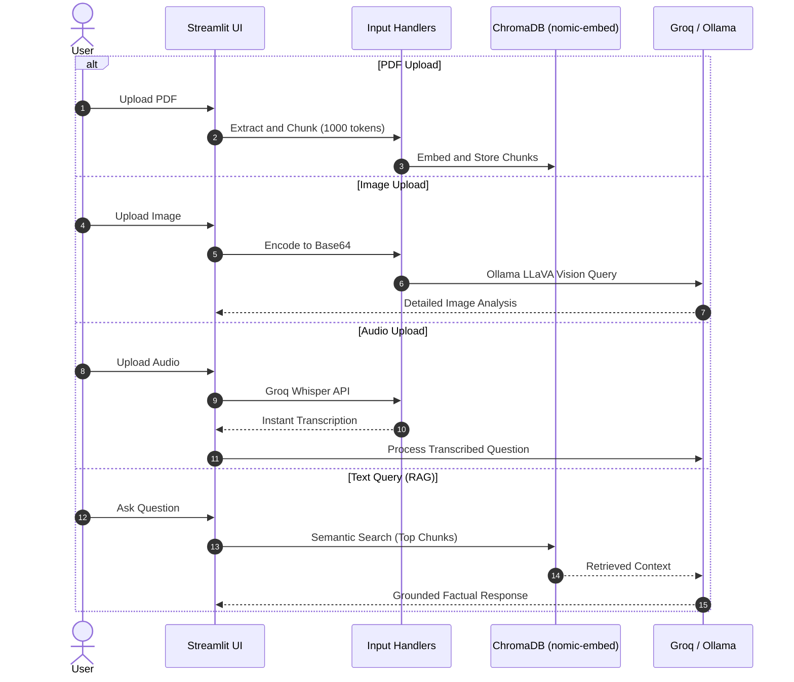

# 📚 Complete Project Documentation: Multimodal RAG

Welcome to the comprehensive technical documentation for the **Multimodal RAG** project.

---

## 🌟 1. Project Overview

**Multimodal RAG** is an intelligent AI application integrating **Retrieval-Augmented Generation (RAG)** with multi-sensory input modalities:
* **Text Chat**: Conversational memory and grounded Q&A.
* **Document Intelligence (PDF)**: Semantic search and grounded answers across uploaded digital and scanned PDF documents.
* **Computer Vision (Image Analysis)**: Comprehensive understanding of diagrams, charts, flowcharts, and photographs.
* **Voice & Audio Processing**: High-speed speech-to-text audio transcription and optional text-to-speech audio synthesis.

---

## 🛠️ 2. Core Architecture & Technologies

### 🖥️ 1. Web Application & UI
* **Streamlit**: Powers the interactive web interface with sidebar controls, media preview players, and dynamic chat streaming.
* **Python 3.10+**: Core programming environment.

### 🧠 2. AI Engines & Hybrid Inference
* **Groq Cloud Platform**:
  * **Model**: `openai/gpt-oss-20b` running on Groq LPU (Language Processing Unit).
  * **Latency**: ~1-2 seconds per complete answer (10x faster than CPU).
* **Ollama Local**:
  * **Model**: `llama3.1:latest` running locally for 100% offline privacy and zero network dependency.
  * **Vision Model**: `llava:latest` (Large Language and Vision Assistant) for deep visual understanding.
  * **Embedding Model**: `nomic-embed-text:latest` for vector generation.

### 📄 3. Document Processing & Vector Storage
* **ChromaDB**: High-speed embedded vector database storing chunked document embeddings.
* **LangChain Text Splitters**: `RecursiveCharacterTextSplitter` configured with `chunk_size=1000` and `chunk_overlap=100` for balanced contextual granularity.
* **Smart Hybrid Prompting**: Intelligently detects whether a PDF has selectable digital text or is a scanned image (e.g. CamScanner), ensuring the assistant always provides rich, useful responses.

### 🎙️ 4. Audio Processing
* **Speech-to-Text (STT)**: Groq's `whisper-large-v3-turbo` model capable of multilingual transcription with near-zero latency.
* **Fallback STT**: Local `SpeechRecognition` library with Google Speech API support.
* **Text-to-Speech (TTS)**: `gTTS` (Google Text-to-Speech) enabled optionally to avoid response delays.

---

## 🔄 3. Operational Workflow



---

## ⚙️ 4. Configuration Details

### `config.yaml`
```yaml
chat_model:
  'model': "llama3.1:latest"
  'temperature': 0.2
  'num_gpu': 1

groq_model:
  'model': "openai/gpt-oss-20b"
  'temperature': 0.2

vector_database:
  chroma:

chat_session_path: './chat_session/'
```
* `temperature: 0.2`: Selected to minimize hallucinations and ensure strict fidelity to provided source documents.

---

## 🔒 5. Security & Best Practices
* Sensitive API keys (`GROQ_API_KEY`, `PINECONE_API_KEY`) are managed strictly through `.env` and kept out of version control via `.gitignore`.
* Automatic fallback logic ensures business continuity if internet access drops during cloud API calls.
