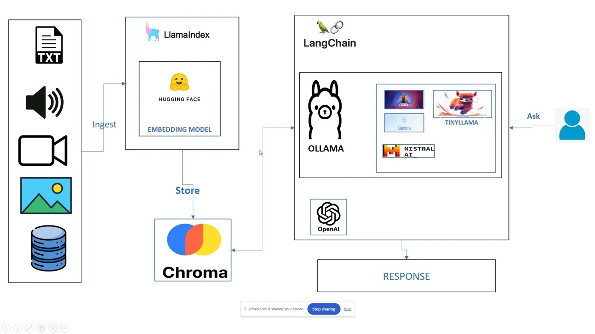
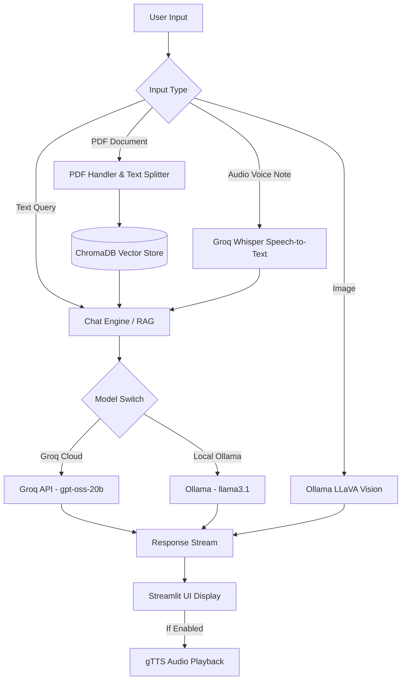

# 🤖 Multimodal RAG (Retrieval-Augmented Generation)



An advanced, high-performance **Multimodal AI Assistant** built with **Streamlit**, **LangChain**, **Groq LPU Cloud Inference**, and **Ollama Local Models**. The system supports intelligent conversational interactions across **Text**, **PDF Documents (RAG)**, **Images (Vision)**, and **Audio Voice Notes (Speech-to-Text & Text-to-Speech)**.

---

## 🌟 Key Features

* **⚡ Ultra-Fast Cloud & Local Hybrid Execution:**
  * **Groq Cloud:** Lightning-fast inference via `openai/gpt-oss-20b` (sub-second responses).
  * **Ollama Local:** 100% offline, privacy-first inference using `llama3.1:latest`.
  * **Seamless Toggle:** Switch between Groq Cloud and local Ollama directly from the sidebar.
  * **Automatic Resilience:** Automatic graceful fallback to local Ollama if internet drops.

* **📄 Intelligent Document RAG (PDF):**
  * Vector search powered by **ChromaDB** with `nomic-embed-text` embeddings.
  * **Optimized Chunking (1000 chunk size):** 2x faster indexing and search retrieval.
  * **Smart Hybrid Retrieval:** Seamlessly handles both digital text PDFs and scanned/watermarked documents (e.g. CamScanner).

* **🖼️ Next-Gen Visual Question Answering (VQA):**
  * Powered by **LLaVA (Large Language and Vision Assistant)** running through Ollama.
  * High-accuracy breakdown of complex diagrams, workflows, screenshots, charts, and photos.
  * One-click **"🔍 Analyze Image"** button + custom query chat.

* **🎙️ Crystal-Clear Speech-to-Text (STT):**
  * Powered by **Groq Whisper-large-v3-turbo** for state-of-the-art accuracy in multiple languages (English, Urdu, Hindi, etc.).
  * Automatic local SpeechRecognition fallback if offline.
  * Dedicated **"🎙️ Transcribe & Ask Audio"** button for immediate vocal Q&A.

* **🔊 Optional Voice Output (TTS):**
  * Text-to-speech output using `gTTS` with a dedicated sidebar toggle so text responses remain instant without unnecessary latency.

---

## 🏗️ Architecture & Pipeline



---

## 📂 Project Structure

```text
Multimodal-RAG/
├── app.py                      # Main Streamlit application and UI interface
├── config.yaml                 # Configuration for models, temperatures, and databases
├── requirements.txt            # Python dependencies
├── .env.example                # Template for environment variables
├── maxresdefault.jpg           # Application banner
├── src/
│   ├── __init__.py
│   ├── groq_chain.py           # Groq Cloud Chain & RAG implementation
│   ├── ollama_chain.py         # Ollama Local Chain & RAG implementation
│   ├── vqa.py                  # High-accuracy Vision Q&A with LLaVA
│   ├── audio_processor.py      # Speech-to-Text (Groq Whisper) & TTS
│   ├── pdf_handler.py          # PDF extraction and chunking
│   ├── vectorstore.py          # ChromaDB and Pinecone vector store handlers
│   └── utils.py                # Configuration loaders and helpers
```

---

## 🚀 Quickstart Guide

### 1. Clone the Repository
```bash
git clone https://github.com/Mehak-Maan/Multimodal-RAG.git
cd Multimodal-RAG
```

### 2. Set Up Virtual Environment
```bash
# Windows (PowerShell)
python -m venv venv
.\venv\Scripts\Activate.ps1

# Linux / macOS
python3 -m venv venv
source venv/bin/activate
```

### 3. Install Dependencies
```bash
pip install -r requirements.txt
```

### 4. Configure Environment Variables
Create a `.env` file in the root directory:
```env
GROQ_API_KEY=your_groq_api_key_here
PINECONE_API_KEY=your_pinecone_api_key_here
```
> *Get a free Groq API key at [console.groq.com](https://console.groq.com).*

### 5. Ensure Ollama Models are Installed
For local offline inference and vision analysis, pull the required models:
```bash
ollama pull llama3.1
ollama pull llava
ollama pull nomic-embed-text
```

### 6. Run the Application
```bash
streamlit run app.py
```
Open your browser at **`http://localhost:8501`**.

---

## ⚙️ Configuration (`config.yaml`)

You can fine-tune model parameters and temperatures in `config.yaml`:
```yaml
chat_model:
  'model': "llama3.1:latest"
  'temperature': 0.2
  'num_gpu': 1

groq_model:
  'model': "openai/gpt-oss-20b"
  'temperature': 0.2

vector_database:
  chroma:

chat_session_path: './chat_session/'
```

---

## 🛡️ License

This project is open source and available under the [Apache License 2.0](LICENSE).
